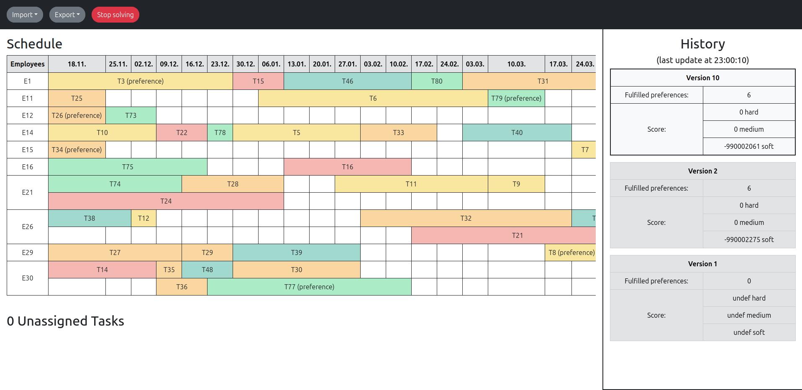

# Project Resource Allocation Tool
This tool is used to automatically allocate resources to projects according to preferences of the resources and requirements of the projects. App expects input data in form of a json file (see below).



## Run project
```
git clone https://github.com/Martin-Nemecky/project-resource-allocation.git
cd project-resource-allocation/
sudo docker compose up --build -d
```
You can see the running app on the page http://localhost:3001/. You can modify the port in the .env file (in the root directory) <br/><br/>
Note: Docker expects that there is a version_1.jar file in the ``backend/RELEASES/`` folder. <br/>
Note: Use --build -d tags with docker compose running the app.

## Input data
The structure of the input data should be as follows:

```json
{
    "skills" : [],
    "projects" : [],
    "stages" : [],
    "tasks" : [],
    "employees" : []
}
```

Optionally you can add configuration object.
```json
{
    "skills" : [],
    "projects" : [],
    "stages" : [],
    "tasks" : [],
    "employees" : [],
    "configurationParameters" : {}
}
```

### Skills
Skills array should define all skills that will be accessed by employee or task later. One skill is defined as: 

| Key  | Value | Required | Unique | Default Value | Description |
| :----: | :----: | :----: | :----: | :----: | :---- |
| id  | number  | true | true | - | identifier of the skill |
| name  | string  | true | false | - | name of the skill |

#### Example:
```json
{ 
    "skills" : [
       {"id": 1, "name": "Java"}
    ]
}
```

### Projects
Projects array should define all projects. One project is defined as:

| Key  | Value | Required | Unique | Default Value | Description |
| :----: | :----: | :----: | :----: | :----: | :---- |
| id  | number  | true | true | - | identifier of the project |
| name  | string  | true | false | - | name of the project |
| deadline  | date  | false | false | 9999-12-31 | deadline of the project in ISO format (YYYY-MM-DD) |

#### Example:
```json
{ 
    "projects" : [
        {"id": 1, "name": "Project One", "deadline" : "2025-05-01"}
    ] 
}
```

### Stages
Stages array should define all project stages of all defined projects. One stage is defined as:

| Key  | Value | Required | Unique | Default Value | Description |
| :----: | :----: | :----: | :----: | :----: | :---- |
| id  | number  | true | true | - | identifier of the stage |
| projectId  | number  | true | false | - | id of previously defined project to which this stage belongs |
| name  | string  | true | false | - | name of the stage |
| rank  | number  | false | false | 0 | defines precedence of the stage (lower number means that the stage will come earlier) |
| isIndependent  | boolean  | false | false | false | if set to true, then all tasks in this stage are independent on other stages |

#### Example:
```json
{ 
    "stages" : [
        {"id" : 1, "projectId": 1, "name" : "Preparation stage", "rank" : 1, "isIndependent" : false}
    ]
}
```

### Tasks

Tasks array should define all tasks of all defined stages. One task is defined as:

| Key  | Value | Required | Unique | Default Value | Description |
| :----: | :----: | :----: | :----: | :----: | :---- |
| id | number | true | true | - | identifier of the task |
| stageId | number | true | false | - | id of previously defined stage to which this task belongs |
| name | string | true | false | - | name of the task | 
| startingDate | date | false | false | undefined | starting date of the task in ISO format (YYYY-MM-DD) <br /> this date changes during planning <br /> if the date is not a monday, than it will be corrected to nearest previous monday date <br /> each task that have defined startingDate should be assigned to an employee |
| isLocked | boolean | false | false | false | if set to true, then the task is fixed and does not change during planning |
| durationInWeeks | number (> 0) | true | false | - | duration of the task in weeks |
| requiredCapacityInFTE | floating number <br /> (0.0 <= x <= 1.0) | true | false | - | required capacity in FTE, where `1.0 FTE = 40 hours per week` |
| requiredCompetences | array of competences | false | false | [] | required competences, where one competence is defined as: <br /> `` {"skillId" : number, "skillLevel" : string} `` <br /> skillLevel value can be one of the following: <br /> ``"JUNIOR"`` or ``"INTERMEDIATE"`` or ``"SENIOR"`` | 

#### Example:
```json
{ 
    "tasks" : [
        {
            "id" : 1,
            "stageId" : 1,
            "name" :  "Backend",
            "startingDate" : "2023-04-10",
            "isLocked" : true,
            "durationInWeeks" : 10,
            "requiredCapacityInFTE" : 0.5,
            "requiredCompetences" : [{"skillId" : 1, "skillLevel" : "INTERMEDIATE"}]
        }
    ]
}
```

### Employees

Employees array should define all employees. One employee is defined as:

| Key  | Value | Required | Unique | Default Value | Description |
| :----: | :----: | :----: | :----: | :----: | :---- |
| firstname | string | true | with lastname - true | - | firstname of the employee | 
| lastname | string | true | with firstname - true | - | lastname of the employee |
| competences | array of competences | false | false | [] | competences, where one competence is defined as: <br /> `` {"skillId" : number, "skillLevel" : string} ``<br /> skillLevel value can be one of the following: <br /> ``"JUNIOR"`` or ``"INTERMEDIATE"`` or ``"SENIOR"`` | 
| capacityInFTE | floating number <br /> (0.0 <= x <= 1.0) | true | false | - | required capacity in FTE, where `1.0 FTE = 40 hours per week` |
| preferredTaskIds | array of numbers | false | false | [] | preferences for the previously defined tasks, order of the ids is important (lower index = more preferred)
| availability | object | true | false | - | availability of the employee, where the object is defined as: <br /> ``{"start" : number, "end" : number}`` <br /> if ``"end"`` is not defined then default value is used (``9999-12-31``)
| assignedTaskIds | array of numbers | false | false | [] | ids of previously defined tasks <br /> each id represent a task that is assigned to this employee |


#### Example:
```json
{ 
    "employees" : [
        {
            "firstname" : "Peter",
            "lastname" : "Young",
            "competences" : [{"skillId" : 1, "skillLevel" : "JUNIOR"}],
            "capacityInFTE" : 0.5,
            "preferredTaskIds" : [1, 5],
            "availability" : {"start" : "2022-01-01", "end" : "2025-01-01"},
            "assignedTaskIds" : [1, 2]
        }
    ]
}
```

### Configuration 
Configuration consists of multiple parameters that can determine lenght of the plan, termination time, capacity overshoot or importance of individual constraints. The object is defined as follows: 

| Key  | Value | Required | Unique | Default Value | Description |
| :----: | :----: | :----: | :----: | :----: | :---- |
| scheduleLengthInWeeks | number<br /> (> 0) | false | false | 26 | schedule length = how many weeks does the tool have to create a schedule |
| terminationTimeInMinutes | number<br /> (> 0) | false | false | 60 | how long should server be planning <br />``client side must be terminated manually``|
| employeePossibleCapacityOverheadInFTE | number<br /> (>= 0) | false | false | 0.1 | possible employee capacity overshoot in FTE |
| skillWeight | number<br /> (>= 0) | false | false | 40 | hard penalization for badly assigned task (based on skill) |
| hardUtilizationWeight | number<br /> (>= 0) | false | false | 1 | hard penalization for badly utilized employee (overutilization > employeeCapacity + capacityOverhead) | 
| projectStageWeight | number<br /> (>= 0) | false | false | 2 | hard penalization for task that is scheduled earlier than it should (based on stage the task is in) |
| availabilityWeight | number<br /> (>= 0) | false | false | 3 | hard penalization for task assigned to an unavailable employee |
| unassignedTaskWeight | number<br /> (>= 0) | false | false | 40 | medium penalization for unassigned task |
| skillLevelWeight | number<br /> (>= 0) | false | false | 20 | soft penalization for mismatch in skill level |
| softUtilizationWeight | number<br /> (>= 0) | false | false | 5 | soft penalization for employee capacity overshoot (but not higher than employeeCapacity + capacityOverhead) |
| taskDelayWeight | number<br /> (>= 0) | false | false | 5 | soft penalization for each week between startingDate of the task and first date of the schedule | 
| deadlineWeight | number<br /> (>= 0) | false | false | 1000000 | soft penalization for each week of the task that exceeded deadline of the project |
| preferenceWeight | number<br /> (>= 0) | false | false | 40 | soft reward for every fulfilled preference of the employee | 
| freeWeekWeight | number<br /> (>= 0) | false | false | 6 | soft reward for every week that employee is completely free | 

#### Example with default values:
```json
{ 
    "configurationParameters" : {
        "scheduleLengthInWeeks" : 26,
        "terminationTimeInMinutes" : 60,
        "employeePossibleCapacityOverheadInFTE" : 0.1,
        "skillWeight" : 40,
        "hardUtilizationWeight" : 1,
        "projectStageWeight" : 2,
        "availabilityWeight" : 3,
        "unassignedTaskWeight" : 40,
        "skillLevelWeight" : 20,
        "softUtilizationWeight" : 5,
        "taskDelayWeight" : 5,
        "deadlineWeight" : 1000000,
        "preferenceWeight" : 40,
        "freeWeekWeight" : 6 
    }
}
```

## Hints
- Refresh page before each planning (because of a bug - project colors do not update properly)
- Recommended waiting time since last schedule was generated is 10 minutes.
- If planning has not generated a new schedule in a long time (for at least 5 minutes), it has either found the best solution or gotten stuck in a local optimum. There are 4 possibilities what you can do: 
    - wait a little longer
    - end solving and save the result (export to file as a json)
    - run the solving again with the same configuration values (the planning is not deterministic so there is a chance that it will generate a different result)
    - run the solving with tweaked configuration values
- If the app does not allocate a task even though there is an available employee, you can force it by setting the task property isLocked to true.

## Used Technologies
Technologies used in this project are:
-   Java with Spring Boot, Optaplanner, gradle
-   Typescript, React, npm